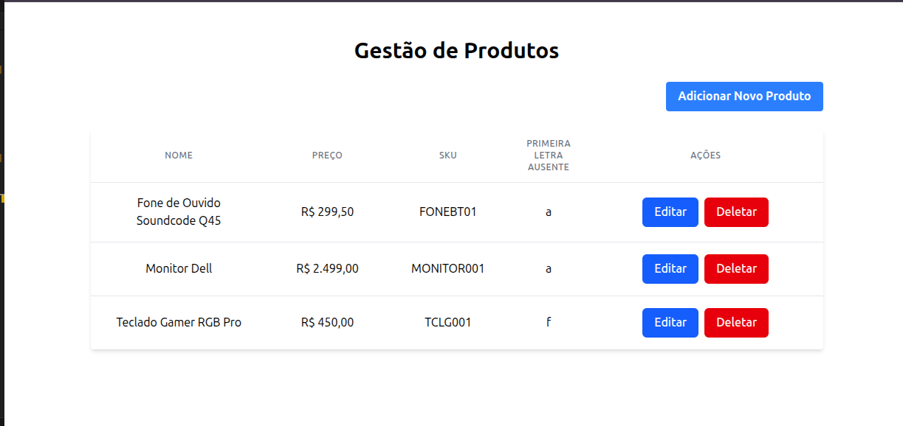

# Products Frontend

Frontend da aplicação de gestão de produtos, construído com ReactJS.

## Funcionalidades

* **Listagem de Produtos:** Exibe todos os produtos com nome, preço, SKU e o atributo `missing_letter`.
* **Criação de Produtos:** Formulário inline para adicionar novos produtos.
* **Edição de Produtos:** Funcionalidade de edição inline para atualizar detalhes de produtos existentes.
* **Exclusão de Produtos:** Permite remover produtos da lista.

## Tecnologias

* React 19.1.0
* Vite 6.3.5
* Vitest 3.1.4

## Demonstração Visual

